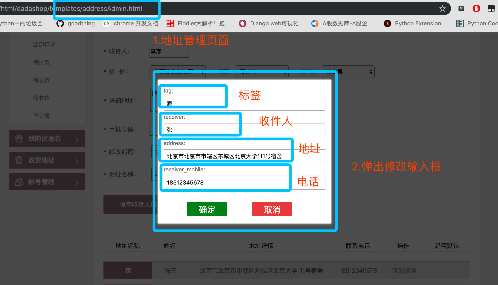
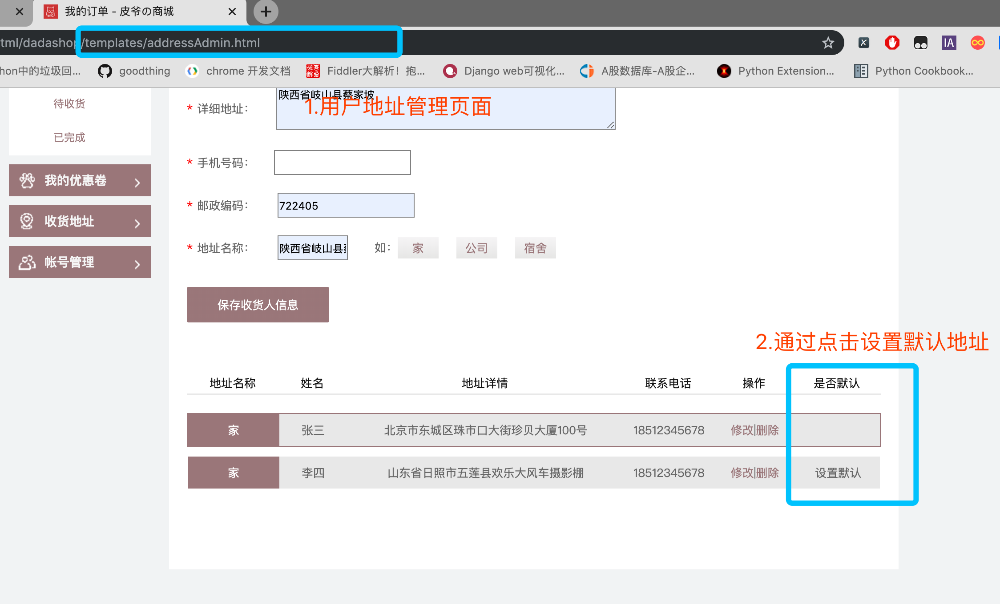
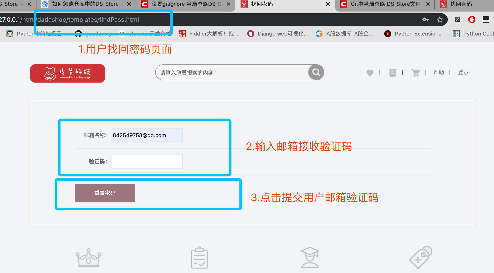
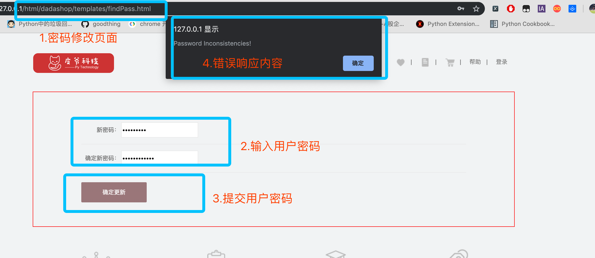

[toc]

# 用户模块-接口说明

## 用户模块相关模型类


- 用户表

  ```python
  from django.db import models
  
  
  class UserProfile(models.Model):
      """用户表"""
      # 用户名、密码、邮箱、手机号、是否激活、创建时间、更新时间
      username = models.CharField(max_length=11, verbose_name="用户名", unique=True)
      password = models.CharField(max_length=32)
      email = models.EmailField()
      phone = models.CharField(max_length=11)
      is_active = models.BooleanField(default=False, verbose_name="是否激活")
  
      created_time = models.DateTimeField(auto_now_add=True)
      updated_time = models.DateTimeField(auto_now=True)
  
      # 修改表名
      class Meta:
          # 表名: 应用名_类名非驼峰
          db_table = "users_user_profile"
  ```

- 地址表

  ```python
  class Address(models.Model):
      """
          收货地址表
          用户表:地址表 ---> 1:n
      """
      user_profile = models.ForeignKey(UserProfile, on_delete=models.CASCADE)
      # 收件人 地址 邮编 手机号
      receiver = models.CharField(verbose_name="收件人", max_length=10)
      address = models.CharField(verbose_name="收件地址", max_length=100)
      postcode = models.CharField(verbose_name="邮编", max_length=6)
      receiver_mobile = models.CharField(verbose_name="手机号", max_length=11)
      # 标签 默认地址
      tag = models.CharField(verbose_name="标签", max_length=10)
      is_default = models.BooleanField(verbose_name="默认地址", default=False)
      # 伪删除
      is_delete = models.BooleanField(verbose_name="伪删除", default=False)
  
      created_time = models.DateTimeField(auto_now_add=True)
      updated_time = models.DateTimeField(auto_now=True)
  
      # 修改表名
      class Meta:
          # 表名: 应用名_类名非驼峰
          db_table = "users_address"
  ```

- 微博表

  ```python
  class WeiboProfile(models.Model):
      """
          微博表
          微博表:用户表 ---> 1:1
      """
      # 微博扫码登录时,暂且不知道和哪个用户绑定
      # 用户输入完成用户信息后,再更新外键的值即可
      user_profile = models.OneToOneField(UserProfile, on_delete=models.CASCADE, null=True)
      wuid = models.CharField(verbose_name="微博uid", max_length=10, db_index=True, unique=True)
      access_token = models.CharField(verbose_name="授权令牌", max_length=32)
  
      created_time = models.DateTimeField(auto_now_add=True)
      updated_time = models.DateTimeField(auto_now=True)
  
      class Meta:
          db_table = "users_weibo_profile"
  ```

# 一.用户模块概述	

​		用户模块主要提供对于是用户使用本产品的基础。用户模块提供以下功能：

>用户注册
>
>用户登录
>
>用户激活
>
>用户收获地址新增/修改/删除/设为默认
>
>找回密码
>
>修改密码
>

# 二.事件定义

## 1. 用户激活

​		用户在注册的同时会同步发送用户激活的邮件。此激活邮件中存在用户激活的链接，用户通过点击此链接之后，在此页面内进行跳转到激活页面，此页面中有两个按钮，是否激活。用户点击激活之后，通过ajax发送激活请求。进行激活。

## 2. 用户地址管理

​	**地址查询功能**：在用户访问到地址页面时，此时会发送用户绑定的地址请求，全量返回有效的用户地址。

​	**增加地址功能**：用户可以提交新增地址，包括收货人、收件地址、地址标签、以及用户的联系方式，通过ajax提交。如果正常存储的话，此时回全量返回用户绑定的地址。

​	**修改地址功能**：用户可以修改有效地址中的收件人、收件地址、练习方式、以及地址标签。提交成功的话，回全量返回用户的地址。

​	**删除地址功能**：用户可以在界面上触发删除地址按钮，此时会将地址的ID通过ajax传入到后台，通过设置该地址的活跃属性来实现删除功能，此功能也是全量返回，然后通过渲染进行在前端展示。

​	**设为默认地址**：用户可以将任意一个非默认地址改为默认地址。通过ajax提交到后端，此功能提交的是地址的ID，将此ID的地址设置为默认，同时将此用户的其他地址ID设为非默认。然后进行全量返回。进行渲染。

## 3. 找回密码

​		用户在登录页可以通过点击找回密码按钮来实现找回密码功能，主要分为三步。首先通过用户发送注册时的邮箱，此时会向邮箱中发送一份关于找回密码的验证码，此验证码会有时效。通过输入对应的验证码，验证没问题之后，显示设置新密码界面，提交之后就可以使用新密码进行登录。

## 4. 修改密码

​		修改密码功能需要在登录情况下进行，在个人账号管理页面中选择，需要输入旧密码以及新密码。通过ajax进行与后端交互。如果用户正确修改密码之后，则需要重新登录。

# 三.API 说明

## 1. 用户注册功能API

用户注册功能API

- **URL**

  `http://127.0.0.1:8000/v1/users/register`

- **请求方法**

  <font color=red>POST</font>

- **请求参数**

  <font color=red>JSON</font>

  | 字段     | 含义       | 类型 | 备注 |
  | -------- | ---------- | ---- | ---- |
  | uname    | 用户名     | char | 必填 |
  | password | 密码       | char | 必填 |
  | phone    | 手机号     | char | 必填 |
  | email    | 邮箱       | char | 必填 |
  | verify   | 短信验证码 | char | 必填 |
  
  **<font color=red>请求示例</font>**
  
  ```python
  {
      'uname': 'zhaoliying',
      'password': '123456',
      'phone': '13603263333',
      'email': 'zhaoliying@tedu.cn',
      'verify': '123456',
  }
  ```
  
- **响应格式**

  - 正确示例

    ```python
    {
        'code': 200,
        'username': 'zhaoliying',
        'token': token,
        'carts_count': 0
    }
    ```

  - 错误示例

    ```python
    {
        'code': xxx,
        'error': 'error reason'
    }
    ```

- **响应数据说明**

  | 字段        | 含义               | 类型 | 备注          |
  | ----------- | ------------------ | ---- | ------------- |
  | code        | 状态码             | int  | 必填          |
  | username    | 用户名             | char | 与error二选一 |
  | data        | 返回数据[token]    | dict | 与error二选一 |
  | carts_count | 购物车商品种类数量 | int  | 与error二选一 |
  | error       | 错误原因           | char | 错误时填写    |

  

## 2. 用户登录功能API

用户登录功能API

- **URL**

  `http://127.0.0.1:8000/v1/users/login`

- **请求方法**

  <font color=red>POST</font>

- **请求参数**

  <font color=red>JSON</font>

  | 字段     | 含义   | 类型 | 备注 |
  | -------- | ------ | ---- | ---- |
  | username | 用户名 | char | 必填 |
  | password | 密码   | char | 必填 |
  
  **<font color=red>请求示例</font>**
  
  ```python
  {
      'username': 'zhaoliying',
      'password': '123456'
  }
  ```
  
- 响应格式

  - 正确响应示例

    ```python
    {
        'code': 200,
        'username': 'zhaoliying',
        'token': token,
        'carts_count': 0
    }
    ```

  - 错误响应示例

    ```python
    {
        'code': xxx,
        'error': 'error reason'
    }
    ```

- **响应数据说明**

  | 字段        | 含义               | 类型 | 备注          |
  | ----------- | ------------------ | ---- | ------------- |
  | code        | 状态码             | int  | 必填          |
  | username    | 用户名             | char | 与error二选一 |
  | data        | 返回数据[token]    | dict | 与error二选一 |
  | carts_count | 购物车商品种类数量 | int  | 与error二选一 |
  | error       | 错误原因           | char | 错误时填写    |


## 3. 邮箱验证激活功能API

​		在用户注册时候，后台会给用户注册填写的邮箱发送一条激活的链接。通过点击链接跳转到达达商城的用户激活页面。通过激活来实现商城所有功能的体验。

#### 3.1 事件触发

​		用户在注册时候会通过邮箱给用户发送一封激活邮件，然后用户通过点击链接，进行重定向到前端地址，此时通过js获取用户前端页面的查询字符串，进行激活。

页面名： **register.html**


#### 3.2 触发结果

正常结果：


 跳转激活页面：

页面地址： **xxx/xxx/active.html**


异常结果：


**URL**：`http://127.0.0.1:8000/v1/users/activation?code=xxxx`

**请求方法**：GET

**请求参数**：JSON

| 字段 | 含义                           | 类型 | 备注 |
| ---- | ------------------------------ | ---- | ---- |
| code | 用户名和随机码base64编码字符串 | char | 必填 |

**返回值**：JSON

**响应格式**：

```json
# 正常响应
{
  'code': 200,
  'data': '激活成功'
}
# 异常响应
{
  'code':xxx,
  'error':'error_reason'
}
```

## 4. 地址管理功能API

### 4.1 地址功能说明

达达商城提供地址增删改查设为默认的功能：

​	查询功能：在用户请求的地址管理页面的时候，等页面主体加载完之后，会发送查询当前用户的绑定地址。返回当前用户绑定的所有地址。

​	增加地址功能：用户可以新增绑定地址。

​	修改地址功能：可以修改用户地址中的任何字段。

​	删除地址功能：可以删除用户所绑定的地址，不是真正的删除，而是在后台将地址改为非活跃的。

​	设为默认地址：用户可以将任意一个非默认地址改为默认地址。默认地址在用户完成付款之前会直接绑定到该订单上。


### 4.2 查询地址

**URL**:`http://127.0.0.1:8000/v1/users/<username>/address`

#### 4.2.1 事件触发

页面名：**addressAdmin.html**


#### 4.2.2 触发结果

​	正常响应：


​	异常响应：

​	如果用户没有登录的访问到地址页面，此时会弹出用户登录提示，然后跳到登录页面。


**请求方法**：GET

返回数据：在访问页面的时候，返回当前用户的所有地址

**返回值**：JSON

**响应格式**：

```json
# 正常数据返回
{
  "code":200,
   "addresslist":[
      {
        'id': 123456, # 地址id
        'address': '河北省石家庄市裕华区幸福快乐大厦1166室', # 地址
        'receiver': '达内科技', # 收货人
        'receiver_mobile': '12345678901', # 联系电话
        'tag': '家', # 地址标签
        'postcode': '722494',  #
        'is_default': True,
      },
      {
         'id': 123457,
         'address': '河北省石家庄市桥东区编程大厦1188室',
         'receiver': '达内科技',
         'receiver_mobile': '12345678910',
         'tag': '公司',
         'postcode': '722406',
         'is_default': False,
      }
    ]
}
# 异常数据返回类型：
{
  'code': status_code,
  'error':'error_reason'
}
```


### 4.3 新增地址

#### 4.3.1 事件触发


#### 4.3.2 触发结果

​	正常结果：


​    异常结果：


**URL**:`http://127.0.0.1:8000/v1/users/<username>/address`

**请求方法**：POST

**请求参数**：JSON

| 参数           | 参数类型  | 含义       | 备注 |
| -------------- | --------- | ---------- | ---- |
| receiver       | char(10)  | 收件人     | 必填 |
| receiver_phone | char(11)  | 收件人电话 | 必填 |
| address        | char(100) | 地址       | 必填 |
| postcode       | char(7)   | 邮编       | 必填 |
| tag            | char(10)  | 标签       | 必填 |

请求示例

```json
{
  'receiver':'小王',
  'receiver_phone':'18667018590',
  'address':'北京市东城区珠市口大街珍贝大厦2楼',
  'postcode':'722405',
  'tag':'公司'
}
```

**返回值**：JSON

**响应格式**：

```json
# 正常响应
{
  "code":200,
  "data":"新增地址成功！"
}
# 异常响应
{
  'code': status_code,
  'error':'error_reason'
}
```

### 4.4 删除地址

#### 4.4.1 事件触发

页面名：**addressAdmin.html**


#### 4.4.2 触发结果

正常触发:


**URL**:`http://127.0.0.1:8000/v1/users/<username>/address/<id>`

**请求方法**：DELETE

**请求参数**: JSON

| 参数     | 参数类型 | 含义   | 备注 |
| -------- | -------- | ------ | ---- |
| id       | char(10) | 地址ID | 必填 |
| username | char(11) | 用户名 | 必填 |

```json
{
  'id':'xxxxxx'
}
```

**返回值**：JSON

**响应格式**：

```json
# 正常响应
{
  "code":200,
   "data":"删除地址成功"
}
# 异常响应：
{
  'code':xxxx,
  'error':'error_reason'
}
```


### 4.5 修改地址

#### 4.5.1 事件触发

页面名：**addressAdmin.html**


#### 4.5.2 触发结果

正常响应




异常响应


**URL**:`http://127.0.0.1:8000/v1/users/<username>/address/<id>`

**请求方式**：PUT

**请求参数**：JSON

| 参数           | 参数类型  | 含义       | 备注 |
| -------------- | --------- | ---------- | ---- |
| tag            | char(10)  | 地址标签   | 必填 |
| receiver_phone | char(11)  | 收件人电话 | 必填 |
| receiver       | char(7)   | 收件人姓名 | 必填 |
| address        | char(100) | 收件人地址 | 必填 |

请求示例：

```json
{
  'receiver':'校长',
  'receiver_mobile':'18667018590',
  'address':'广东省深圳市龙华区民治大道100号',
  'tag':'公司',
}
```

**返回值**：JSON

**响应格式**：

```json
# 正常响应
{
  "code":200,
  "data":"地址修改成功！"
}

# 异常响应
{
    "code": xxx,
     'error':'error_reason'
}
```

### 4.6 设为默认地址

#### 4.6.1 事件触发

页面名：**addressAdmin.html**



#### 4.6.2 触发结果

正常触发


**URL**：`http://127.0.0.1:8000/v1/users/<username>/address/default`

请求类型：**POST**

| 参数 | 参数类型 | 含义   | 备注 |
| ---- | -------- | ------ | ---- |
| id   | char(10) | 地址ID | 必填 |

请求示例

```json
{
  'id':'xxxxxxx'
}
```

**返回值**：JSON

**响应格式**：

```json
# 正常响应
{
  "code":200,
  "data":"设为默认成功！"
}
# 异常响应
{
  'code':xxx,
  'error':'error_reason'
}
```


## 5. 修改密码

 在登录的状态下才能够修改用户登录密码。

#### 5.1 事件触发

页面名： **personal_password.html**


#### 5.2 触发结果

​	触发成功：


​	触发失败：


修改密码API：

**URL**: `http://127.0.0.1:8000/v1/users/<username>/password`

**请求方法**：POST

**请求参数**：JSON

| 字段        | 含义     | 类型 | 备注 |
| ----------- | -------- | ---- | ---- |
| oldpassword | 旧密码   | char | 必填 |
| password1   | 新密码   | char | 必填 |
| password2   | 确认密码 | char | 必填 |

请求示例：

```json
{
  'oldpasword':'123456',
  'password1':'123321',
  'password2':'654321'
}
```

| 字段    | 含义                                     | 类型 | 备注                      |
| ------- | ---------------------------------------- | ---- | ------------------------- |
| code    | 状态                                     | int  | 默认正常为200。异常见附录 |
| error   | 错误信息                                 | dict | 与data二选一              |
| data    | 正确信息                                 | dict | 与error二选一             |
| message | 包含在正确信息或者错误信息中，为具体原因 | char | 存在于data或者error中     |

**返回值**：JSON

**响应格式**：

```json
# 正确示例
{
  'code':200,
  'data':'修改成功'
}
# 错误示例
{
  'code':xxx,
  'error':'error reason'
}
```


## 6. 找回密码功能

**时序图**


### 6.1 发送邮箱验证请求

#### 6.1.1 事件触发

页面名： **findPass.html**


#### 6. 1.2 触发结果

邮箱中可以收到后台发送的邮箱验证码（10分钟之内有效）：


触发失败：


发送邮箱验证

**URL**：`http://127.0.0.1:8000/v1/users/password/sms`

**请求方法**：POST

**请求参数**：JSON

| 字段  | 含义 | 类型 | 备注             |
| ----- | ---- | ---- | ---------------- |
| email | 邮箱 | char | 通过邮箱找回密码 |

请求示例：

```json
{
	'email':xxxxx # 邮箱
}
```

响应数据

| 字段  | 含义         | 类型 | 备注          |
| ----- | ------------ | ---- | ------------- |
| code  | 状态码       | int  | 必填          |
| data  | 返回数据     | dict | 与error二选一 |
| error | 返回错误原因 | char | 与data二选一  |

**返回值**：JSON

**响应格式**：

```json
# 正常响应
{
  'code':200,
  'data':"邮件发送成功",
}
# 异常响应
{
  'code':xxx,
  'error':'error reason'
}
```


### 6.2 发送邮箱验证码

#### 6.2.1 事件触发

页面名： **findPass.html**


#### 6.2.2 触发结果

正常结果：



异常结果：


发送邮箱验证码：

**URL**：`http://127.0.01:8000/v1/users/password/verification/`

**请求方法**： POST

**请求参数**：JSON

| 字段  | 含义   | 类型 | 备注 |
| ----- | ------ | ---- | ---- |
| email | 邮箱   | char | 必填 |
| code  | 验证码 | char | 必填 |

```json
{
  'email':'xxxx',
  'code':'xxxx'
}
```

响应数据：

| 字段  | 含义           | 类型 | 备注          |
| ----- | -------------- | ---- | ------------- |
| code  | 响应状态吗     | char | 必填          |
| data  | 返回正常数据() | dict | 与error二选一 |
| error | 返回错误原因() | char | 与data二选一  |

**返回值**：JSON

**响应格式**：

```json
# 正常响应
{
  'code':200,
 	'data':'验证码通过'，
  'email’：‘xxxx’ # 返回邮箱
}
# 异常响应
{
  'code':xxx,
  'error':'error reason'
}
```

### 6.3 修改密码

#### 6.3.1 事件触发

页面名： **findPass.html**


#### 6.3.2 触发结果

正常响应


异常响应：



修改密码：

**URL**：`http://127.0.0.1:8000/v1/users/password/new`

**请求方法**：POST

**请求参数**：JSON

| 字段      | 含义     | 类型 | 备注 |
| --------- | -------- | ---- | ---- |
| email     | 邮箱     | char | 必填 |
| password1 | 新密码   | char | 必填 |
| Password2 | 确认密码 | char | 必填 |

请求i示例

```json
{
	"email":"xxx",    # 通过用户邮箱锁定用户
  'password1':'xxx' # 新密码
  'password2':'xxx' # 确认密码
}
```

响应数据：

| 字段    | 含义         | 类型 | 备注             |
| ------- | ------------ | ---- | ---------------- |
| code    | 响应状态码   | char | 必填             |
| data    | 返回正常数据 | dict | 与error二选一    |
| error   | 返回异常数据 | dict | 与data二选一     |
| message | 具体响应信息 | char | 正确或者错误原因 |

**返回值**：JSON

**响应格式**：

```json
# 正常数据
{
  'code':200,
  'data':'OK'
}
#  异常数据
{
  'code':xxx,
  'error':'error reason'
}
```
