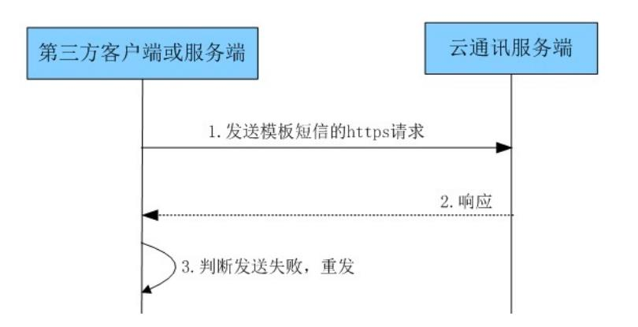
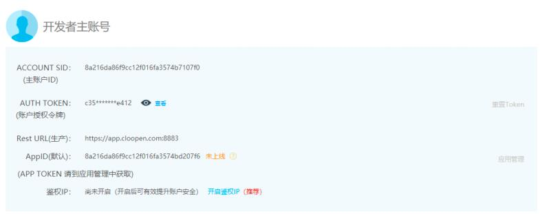

[toc]

# 《达达商城》短信验证API文档说明

| 问题                                   | 说明                                                         |
| -------------------------------------- | ------------------------------------------------------------ |
| 什么情况使用短信？？？                 | 短信通知【短信登录、短信验证码、快递物流情况、提货码】       |
| 谁来发送短信？？？                     | 前端 or 后端？？？                                           |
| 短信验证码存储在哪里？？？             | 因为短信验证码存在时效性。【redis 存储】                     |
| 核心问题，后端有发送短信的功能吗？？？ | 发送短信【中国联通、中国移动、中国电信】 <br>第三方平台【百度云 、阿里云、腾讯云、<font color="red">容联云</font>】 |

## 容联云通信 短信业务接口

- [容联云](https://www.yuntongxun.com/)
- 进行注册

### 业务流程说明




### 控制台核心说明



### 1、Base URL

模板短信API引用的地址有Base URL。

生产环境的Base URL：[https://app.cloopen.com:8883](https://app.cloopen.com:8883/)

注意：为了确保数据隐私，云通讯平台的REST API是通过HTTPS方式请求。

### 2、业务URL

业务URL格式：/2013-12-26/Accounts/{accountSid}/SMS/{funcdes}?sig={SigParameter}

在URL格式中 {}内的内容表示为参数，非{}的内容固定不变。

Base URL与业务URL相拼接为完整请求URL，完整URL示例：

https://app.cloopen.com:8883/2013-12-26/Accounts/abcdefghijklmnopqrstuvwxyz012345/SMS/TemplateSMS?sig=C1F20E7A9733CE94F680C70A1DBABCD

**属性说明：**

| 属性         | 类型   | 约束 | 说明                                                         |
| ------------ | ------ | ---- | ------------------------------------------------------------ |
| accountSid   | String | 必选 | 开发者主账户ACCOUNT SID（登录官网在管理控制台获取）          |
| SigParameter | String | 必选 | REST API 验证参数，<font color="red"><b>生成规则</b></font>>如下:<br>1. 使用MD5加密（账户Id + 账户授权令牌 + 时间戳）。<br>    其中账户Id和账户授权令牌根据url的验证级别对应主账户。<br>    时间戳是当前系统时间，格式"yyyyMMddHHmmss"。<br>    时间戳有效时间为24小时，<br>如：<br>       201404161420302.SigParameter<font color="red">参数需要大写</font>，如不能写成sig=abcdefg而应该写成sig=ABCDEFG |

### 3、HTTP标准包头字段

```python
Accept:application/xml;
Content-Type:application/xml;charset=utf-8;
Content-Length:256; 
Authorization:
```

**属性说明:**

| 属性           | 类型   | 约束 | 说明                                                         |
| -------------- | ------ | ---- | ------------------------------------------------------------ |
| Accept         | String | 必选 | 客户端响应接收数据格式：<br>application/xml、application/json |
| Content-Type   | String | 必选 | 类型：<br>application/xml;charset=utf-8<br>application/json;charset=utf-8 |
| Content-Length | String | 必选 | Content-Length                                               |
| Authorization  | String | 必选 | 验证信息，<font color="red"><b>生成规则</b></font>详见下方说明<br>1. 使用Base64编码（账户Id + 冒号 + 时间戳）其中账户Id根据url的验证级别对应主账户<br/>2. 冒号为英文冒号<br/>3. 时间戳是当前系统时间，格式"yyyyMMddHHmmss"，需与SigParameter中时间戳相同。 |

### 4、发送模板短信接口

#### 4.1 请求地址

​		POST /2013-12-26/Accounts/{accountSid}/SMS/TemplateSMS?sig={SigParameter}

#### 4.2 请求包体

| 属性       | 类型   | 约束 | 说明                                                         |
| ---------- | ------ | ---- | ------------------------------------------------------------ |
| to         | String | 必选 | 短信接收端手机号码集合，用英文逗号分开，每批发送的手机号数量不得超过200个 |
| appId      | String | 必选 | 应用Id，官网控制台应用列表获取                               |
| templateId | String | 必选 | 模板Id，官网控制台模板列表获取。测试模板id是1。测试模板的内容是：【云通讯】您使用的是云通讯短信模板，您的验证码是{1}，请于{2}分钟内正确输入 |
| datas      | String | 可选 | 内容数据外层节点，模板如果没有变量，此参数可不传，多个变量，使用数组的数据格式 |
| data       | String | 可选 | 内容数据，用于替换模板中{序号}                               |
| subAppend  | String | 可选 | 扩展码，四位数字 0~9999                                      |
| reqId      | String | 可选 | 第三方自定义消息id，最大支持32位，同账号下同一自然天内不允许重复。 |

<font color=blue>JSON请求示例</font>

```json
POST 
/2013-12-26/Accounts/abcdefghijklmnopqrstuvwxyz012345/SMS/TemplateSMS?sig=C1F20E7A9733CE94F680C70A1DBABCDE 

HTTP/1.1  
Host:192.168.0.1:8883 content-length: 
139 Accept:application/json;  
Content-Type:application/json;charset=utf-8;  
Authorization:ZmY4MDgwODEzYzM3ZGE1MzAxM2M4MDRmODA3MjAwN2M6MjAxMzAyMDExNTABCDE=  

{
    "to":"13911281234,15010151234,13811431234",
    "appId":"ff8080813fc70a7b013fc72312324213",
    "reqId":"abc123",
    "subAppend":"8888",
    "templateId":"1",
    "datas":["替换内容","替换内容"]
}                       
```

#### 4.3 响应包体

- 此步响应只表明接口请求成功，不代表短信已送达手机。具体送达状态请参考“状态报告部分”
- 对响应解析后，statusCode为"000000"表示请求发送成功。statusCode非"000000"表示请求发送失败，客户服务端可以根据自己的逻辑进行重发或者其他处理。

| 属性          | 类型   | 约束 | 说明                                                         |
| ------------- | ------ | ---- | ------------------------------------------------------------ |
| statusCode    | String | 必选 | 请求状态码，取值000000（成功），其余状态码含义详见短信错误码部分 |
| smsMessageSid | String | 必选 | 短信唯一标识符                                               |
| dateCreated   | String | 必选 | 短信的创建时间，格式：yyyyMMddHHmmss                         |

<font color=blue>JSON响应示例</font>

```json
HTTP/1.1 200 OK  Content-Length: 641  

{
    "statusCode":"000000",
    "templateSMS":{
        "dateCreated":"20130201155306",
        "smsMessageSid":" ff8080813c373cab013c94b0f0512345"
    }
}                    
```