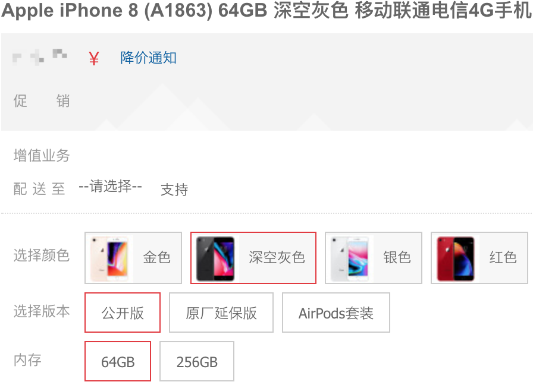
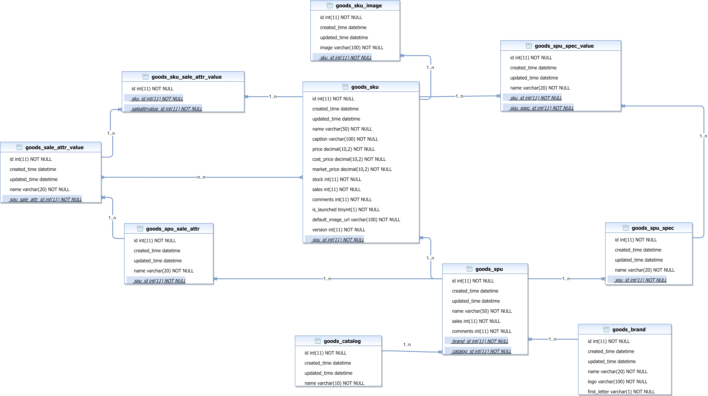
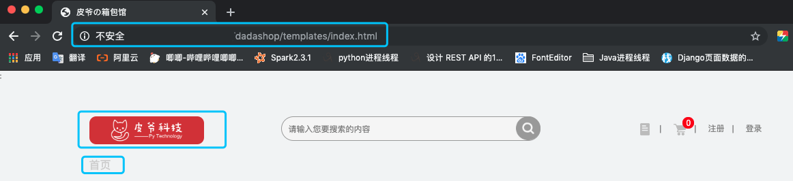
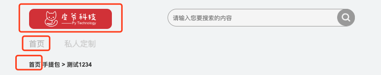
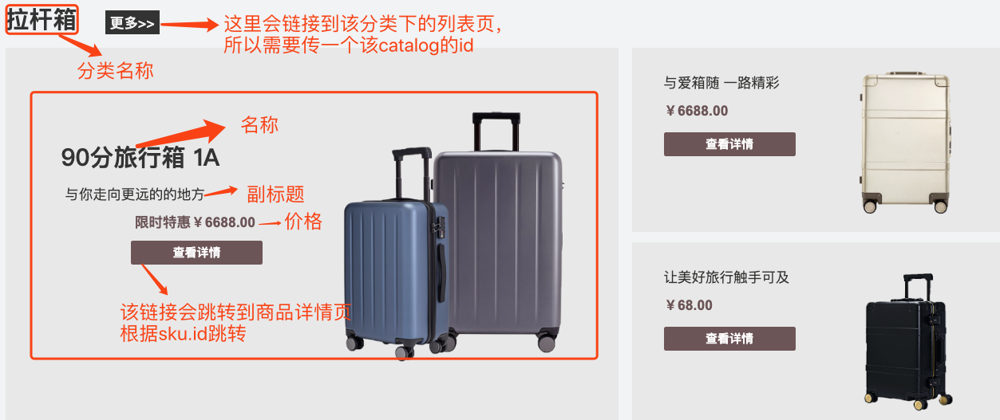
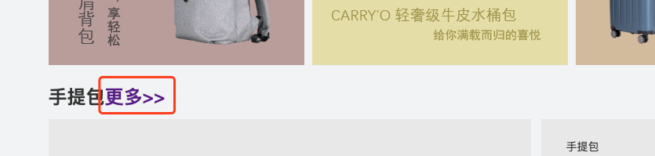
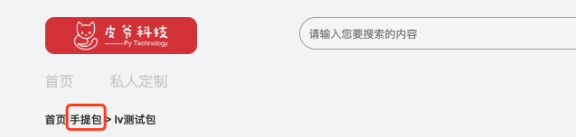
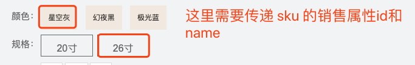
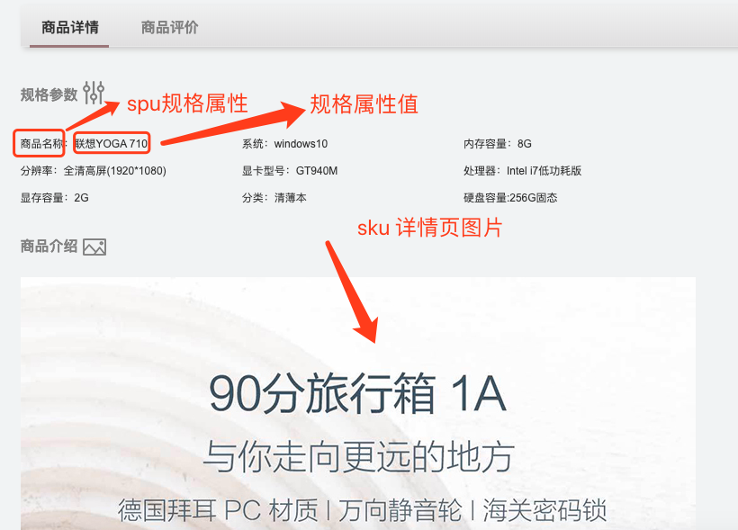
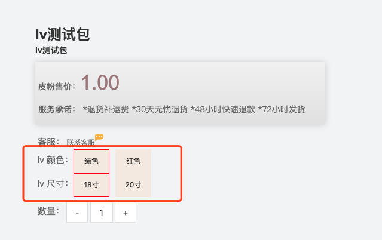

[toc]

# 商品模块-接口说明

## SPU和SKU

> 在电商中对于商品，有两个重要的概念：**SPU**和**SKU**

### 1. SPU介绍

- SPU = Standard Product Unit （标准产品单位）
  - SPU是商品信息聚合的最小单位，是一组可服用、易检索的标准化信息的集合，该集合描述了一个产品的特性。
  - 通俗的讲，属性值、特性相同的商品就可以归类到一类SPU。
  - 例如:
    - `iPhone X` 就是一个**SPU**，与商家、颜色、款式、规格、套餐等都无关。


### 2. SKU介绍

**SKU = Stock Keeping Unit （库存量单位）**

- SKU即库存进出计量的单位，可以是以件、盒等为单位，是物理上不可分割的最小存货单元。
- 通俗的讲，SKU是指一款商品，每款都有一个SKU，便于电商品牌识别商品。
- 例如：
  - `iPhone X 全网通 黑色 256G` 就是一个**SKU**，表示了具体的规格、颜色等信息。


## 表结构设计以及MODELS

### 1、表结构设计



### 2、models编写

根据之前设计好的表结构来写models.py文件

```python
from django.db import models


# Create your models here.
class Catalog(models.Model):
    """
    商品类别
    """
    name = models.CharField(max_length=10, verbose_name='类别名称')
    created_time = models.DateTimeField(auto_now_add=True)
    updated_time = models.DateTimeField(auto_now=True)

    class Meta:
        db_table = "goods_catalog"
        verbose_name = '商品类别'
        verbose_name_plural = verbose_name


class Brand(models.Model):
    """
    品牌
    """

    name = models.CharField(max_length=20, verbose_name='商品名称')
    logo = models.ImageField(verbose_name='Logo图片', upload_to='brand')
    first_letter = models.CharField(max_length=1, verbose_name='品牌首字母')
    created_time = models.DateTimeField(auto_now_add=True)
    updated_time = models.DateTimeField(auto_now=True)

    class Meta:
        db_table = "goods_brand"
        verbose_name = '品牌'
        verbose_name_plural = verbose_name


class SPU(models.Model):
    name = models.CharField(max_length=50, verbose_name='名称')
    sales = models.IntegerField(default=0, verbose_name='商品销量')
    comments = models.IntegerField(default=0, verbose_name='评价数量')
    brand = models.ForeignKey(Brand, verbose_name='品牌', on_delete=models.CASCADE)
    catalog = models.ForeignKey(Catalog, verbose_name='商品类别', on_delete=models.CASCADE)
    created_time = models.DateTimeField(auto_now_add=True)
    updated_time = models.DateTimeField(auto_now=True)

    class Meta:
        db_table = "goods_spu"
        verbose_name = 'SPU'
        verbose_name_plural = verbose_name


class SPUSaleAttr(models.Model):
    """
    SPU销售属性表
    """
    spu = models.ForeignKey(SPU, on_delete=models.CASCADE)
    name = models.CharField(max_length=20, verbose_name='SPU属性名称')
    created_time = models.DateTimeField(auto_now_add=True)
    updated_time = models.DateTimeField(auto_now=True)

    class Meta:
        db_table = 'goods_spu_sale_attr'
        verbose_name = 'SPU销售属性'
        verbose_name_plural = verbose_name


class SaleAttrValue(models.Model):
    """
    销售属性值表
    """
    spu_sale_attr = models.ForeignKey(SPUSaleAttr, on_delete=models.CASCADE, verbose_name='销售属性')
    name = models.CharField(max_length=20, verbose_name='销售属性值名称')
    created_time = models.DateTimeField(auto_now_add=True)
    updated_time = models.DateTimeField(auto_now=True)

    class Meta:
        db_table = 'goods_sale_attr_value'
        verbose_name = '销售属性值'
        verbose_name_plural = verbose_name


class SKU(models.Model):
    """
    SKU
    """
    name = models.CharField(max_length=50, verbose_name='SKU名称')
    caption = models.CharField(max_length=100, verbose_name='副标题')
    spu = models.ForeignKey(SPU, on_delete=models.CASCADE)
    price = models.DecimalField(max_digits=10, decimal_places=2, verbose_name='单价')
    cost_price = models.DecimalField(max_digits=10, decimal_places=2, verbose_name='进价')
    market_price = models.DecimalField(max_digits=10, decimal_places=2, verbose_name='市场价')
    stock = models.IntegerField(default=0, verbose_name='库存')
    sales = models.IntegerField(default=0, verbose_name='销量')
    comments = models.IntegerField(default=0, verbose_name='评价数')
    is_launched = models.BooleanField(default=True, verbose_name='是否上架销售')
    default_image_url = models.ImageField(verbose_name='默认图片', default=None, upload_to='sku')
    version = models.IntegerField(default=0, verbose_name="库存版本")
    sale_attr_value = models.ManyToManyField(SaleAttrValue)
    created_time = models.DateTimeField(auto_now_add=True)
    updated_time = models.DateTimeField(auto_now=True)

    class Meta:
        db_table = "goods_sku"
        verbose_name = 'SKU表'
        verbose_name_plural = verbose_name
    
    def __str__(self):
        return '%s: %s' % (self.id, self.name)

class SKUImage(models.Model):
    """
        SKU图片
    """
    sku = models.ForeignKey(SKU, on_delete=models.CASCADE, verbose_name='sku')
    image = models.ImageField(verbose_name='图片路径', upload_to='sku_images')
    created_time = models.DateTimeField(auto_now_add=True)
    updated_time = models.DateTimeField(auto_now=True)

    class Meta:
        db_table = 'goods_sku_image'
        verbose_name = 'SKU图片'
        verbose_name_plural = verbose_name


class SPUSpec(models.Model):
    """
    SPU规格表
    """
    spu = models.ForeignKey(SPU, on_delete=models.CASCADE)
    name = models.CharField(max_length=20, verbose_name='SPU规格名称')
    created_time = models.DateTimeField(auto_now_add=True)
    updated_time = models.DateTimeField(auto_now=True)

    class Meta:
        db_table = 'goods_spu_spec'
        verbose_name = 'SPU规格'
        verbose_name_plural = verbose_name


class SKUSpecValue(models.Model):
    """
    SKU规格属性表
    """
    sku = models.ForeignKey(SKU, on_delete=models.CASCADE)
    spu_spec = models.ForeignKey(SPUSpec, on_delete=models.CASCADE)
    name = models.CharField(max_length=20, verbose_name='SKU规格名称值')
    created_time = models.DateTimeField(auto_now_add=True)
    updated_time = models.DateTimeField(auto_now=True)

    class Meta:
        db_table = 'goods_spu_spec_value'
        verbose_name = 'SKU规格属性值表'
        verbose_name_plural = verbose_name
```

## 一、商品模块概述

<font color=red>商品模块是整个电商项目的核心部分，各个模块都是围绕商品模块展开，主要分为以下几个功能(还在不断拓展中)</font>

1. 商品首页展示 
2. 商品品类页展示
3. 商品详情页展示
4. 商品首页搜索以及搜索页展示
5. 商品详情页 sku 切换


## 二、事件定义

### 1. 商品首页展示

- **数据展示部分**

  在商城首页的下半部为商品部分展示，在首页展示的效果为每个品类下展示三个该品类的商品，即三个分类下的 sku，如果每个类别下的sku不足三个会报错，这一点需注意

- **缓存管理部分**

  在首页展示部分还添加了缓存数据管理的部分，用到了 redis 数据库


### 2. 商品品类页展示

- **数据展示部分**

  根据商品的不同分类进行相应的展示，具有分页展示的功能，是根据类别 id 进行的分类筛选

  

### 3. 商品详情页展示

- **数据展示部分**

  为确定到某一个 sku 需要在商品详情页选择相关的一组销售属性以及该组销售属性所对应的一组销售属性值来确定库存项。再次强调，最终购买的商品是一个具体的 sku 对象所代表的商品，而不是一个模棱两可的概念，比如 iphone 11 并不能直接去购买，而可以去购买的可能是 iphone 11 墨绿色 64G 这个特定的 sku

- **SKU切换**

  在该功能中还有切换 sku 的功能部分，在详情页展示接口中会传入该 sku 所属的 spu 的 id，通过 spu_id 可获取到 spu 下的 sku 列表，之后通过销售属性值进行 sku 筛选，将筛选的 sku id 返回给前端

- **详情页缓存管理**  

  在详情页展示部分还添加了缓存数据管理的部分，用到了 redis 数据库


### 4. 详情页 SKU 切换

​		在详情页展示接口中会传入该 sku 所属的 spu 的 id，通过 spu_id 可获取到 spu 下的 sku 列表，之后通过销售属性值进行 sku 筛选，将筛选的 sku id 返回给前端。  


## 三、API说明

### 1. 首页商品展示

**URL：**`http://127.0.0.1:8000/v1/goods/index`

**接口定位**：

​    1. 商城首页



​	2. 商品详情页，列表页以及搜索结果页



2. 效果图

##### 注意：在做首页展示的时候，必须保证每个 catalog 下至少有三个 sku 的数据，否则页面显示异常。



**请求方式**：GET

**返回值：**JSON

| 字段                             | 含义                         | 类型 | 备注          |
| -------------------------------- | ---------------------------- | ---- | ------------- |
| code                             | 状态                         | int  | 默认正常为200 |
| data(以下数据均为data下的子数据) | 返回具体的数据都包含在data中 | {}   |               |
| catalog_id                       | 品类id                       | int  |               |
| catalog_name                     | 品类名称                     | str  |               |
| sku                              | 该列表下为商品具体数据       |      |               |
| skuid                            | skuid                        | int  |               |
| name                             | sku商品标题                  | str  |               |
| caption                          | sku副标题                    | str  |               |
| price                            | sku价格                      | str  |               |
| image                            | sku图片                      | str  |               |
| base_url                         | 图片 base_url                | str  |               |

**响应格式**：

```python
{
    "code": 200,
    "data": [
        {
            "catalog_id": 1,
            "catalog_name": "手提包",
            "sku": [
                {
                    "skuid": 1,
                    "caption": "测试1",
                    "name": "测试1234",
                    "price": "2.00",
                    "image": "1.jpg"
                },
                {
                    "skuid": 2,
                    "caption": "测试2",
                    "name": "测试2",
                    "price": "1.00",
                    "image": "2.jpg"
                },
                {
                    "skuid": 3,
                    "caption": "测试3",
                    "name": "测试3",
                    "price": "1.00",
                    "image": "3.jpg"
                }
            ]
        }
    ],
    "base_url": "http://127.0.0.1:8000/media/"
}
```

**状态码参考**：

| 状态码 | 响应信息 | 原因短语 |
| ------ | -------- | -------- |
| 200    | 正常     | OK       |


### 2. 获取商品品类页接口

**URL：**`http://127.0.0.1:8000/v1/goods/catalogs/<catalog_id>`

**接口定位：**

1. 首页展示

   

2. 详情展示页

   


**请求方式:** GET

**请求参数：**

**URL：**`http://127.0.0.1:8000/v1/goods/catalogs/<catalog_id>?launched=true&page=1&pagesize=9`

| 字段     | 含义                 | 类型 | 备注       |
| -------- | -------------------- | ---- | ---------- |
| launched | 该sku是否上线        | str  | 默认为true |
| page     | 分页项的当前页参数   | int  |            |
| pagesize | 每页所展示数据的数量 | int  |            |

**返回值：**JSON

**响应格式**：

```python
{
    "code": 200,
    "data": [
        {
            "skuid": 1,
            "name": "测试1",
            "price": "2.00",
            "image": "v2-b01fad0ef311933a6308c14b2a00a35e_r.jpg"
        },
        {
            "skuid": 2,
            "name": "测试2",
            "price": "1.00",
            "image": "1_lxYxmFz.jpg"
        },
        {
            "skuid": 3,
            "name": "测试3",
            "price": "1.00",
            "image": "v2-b01fad0ef311933a6308c14b2a00a35e_r_fG82hdD.jpg"
        },
        {
            "skuid": 4,
            "name": "测试4",
            "price": "1.00",
            "image": "v2-b01fad0ef311933a6308c14b2a00a35e_r_7D60joF.jpg"
        },
        {
            "skuid": 5,
            "name": "测试5",
            "price": "1.00",
            "image": "dl.jpeg"
        },
        {
            "skuid": 6,
            "name": "测试6",
            "price": "1.00",
            "image": "v2-b01fad0ef311933a6308c14b2a00a35e_r_9vdsRzK.jpg"
        },
        {
            "skuid": 7,
            "name": "测试7",
            "price": "1.00",
            "image": "1_bNbqu9f.jpg"
        },
        {
            "skuid": 8,
            "name": "测试8",
            "price": "1.50",
            "image": "1_NHrTbfx.jpg"
        },
        {
            "skuid": 9,
            "name": "测试9",
            "price": "1.00",
            "image": "v2-b01fad0ef311933a6308c14b2a00a35e_r_2nbsI3S.jpg"
        }
    ],
    "paginator": {
        "pagesize": 9,
        "total": 10
    },
    "base_url": "http://127.0.0.1:8000/media/"
}
```

| 字段     | 含义       | 类型 | 备注                        |
| -------- | ---------- | ---- | --------------------------- |
| code     | 状态码     | int  | 默认正常为200，异常见状态码 |
| data     | 具体数据   | dict | 与error二选一               |
| error    | 错误信息   | char | 与data二选一                |
| base_url | 图片根路径 | str  |                             |

**data参数信息**

| 参数  | 类型 | 是否必须 |       说明       |
| :---: | :--: | :------: | :--------------: |
| skuid | int  |    是    |    商品sku_id    |
| name  | str  |    是    |     商品名称     |
| price | int  |    是    |     商品价格     |
| image | str  |    是    | 商品默认图片路径 |

**状态码参考**

| 状态码 | 响应信息                      | 原因短语                      |
| ------ | ----------------------------- | ----------------------------- |
| 200    | 正常                          | OK                            |
| 40200  | 页数有误，小于0或者大于总页数 | 页数有误，小于0或者大于总页数 |


### 3. 商品详情页展示

**URL：**`http://127.0.0.1:8000/v1/goods/detail/<sku_id>`

**请求方式**：GET

**返回值**：JSON

效果图

详情页展示，展示的是每个 sku 下的具体信息，所以需要参数 sku_id。

这里需要传递的数据有：

1. 类别的id，类别的名称
2. sku的名称，sku的副标题，sku的id，sku的图片
3. spu的销售属性id以及名称以及销售属性值id以及名称


这里还有个需要注意的地方，就是 sku 销售属性值高亮显示的问题，当我们打开一个详情页的时候，必然是所有的属性已经有了该 sku 的所有销售属性值，并将该 sku 的属性值高亮显示，所以我们还需要从 SKUSaleAttrValue  和 SaleAttrValue 表中拿到 sku 销售属性值的id和name，将数据交给前端进行比较，从而高亮显示：



至于切换在详情页切换 sku 的功能会在后续说到。

在详情页下半部分还有需要注意的地方就是商品规格部分和详情页大图部分：




**响应格式：**

```python
{
    "code": 200,
    "data": {
        # 类1:类别id 类别name
        "catalog_id": 1,
        "catalog_name": "手提包",
        
        # 类2：SKU
        "name": "手提包",
        "caption": "最时尚的手提包",
        "price": "12345.00",
        "image": "1.png",
        "spu": 2,
		
        # 类3：详情图片
        "detail_image": "v2-1.jpg",
        
        # 类4：销售属性
        "sku_sale_attr_id": [7,8]
        "sku_sale_attr_names": ["尺寸","颜色"],
        
        # 类5：销售属性值
        "sku_sale_attr_val_id": [11,12,13]
        "sku_sale_attr_val_names": ["18寸","19寸","蓝色"],
        
        # 销售属性和销售属性值的对应关系
        "sku_all_sale_attr_vals_id": {
            "7": [11,12],
            "8": [13]
        },
        "sku_all_sale_attr_vals_name": {
            "7": ["18寸","19寸"],
            "8": ["蓝色"]
        },
        
        # 类6和类7：规格属性名和规格属性值
        "spec": {
            "批次": "2000",
            "数量": "2000",
            "年份": "2000"
        }
    },
    "base_url": "http://127.0.0.1:8000/media/"
}
```

| 字段                        | 含义                               | 类型 | 备注           |
| --------------------------- | ---------------------------------- | ---- | -------------- |
| code                        | 状态                               | Int  | 正常为200      |
| data                        | 返回的具体数据均在data里           | {}   | 数据格式见上图 |
| image                       | sku图片                            | str  |                |
| spu                         | 该sku所对应的spu                   | int  |                |
| name                        | sku正标题                          | str  |                |
| caption                     | sku副标题                          | str  |                |
| price                       | sku销售价                          | str  |                |
| catalog_id                  | 类别id                             | int  |                |
| catalog_name                | 类别名称                           | str  |                |
| detail_image                | 详情页大图                         | str  |                |
| spec                        | 商品规格以及规格值                 | dict |                |
| sku_sale_attr_id            | 该sku所具备的销售属性id            | list |                |
| sku_sale_attr_names         | 该sku所具备的销售属性名称          | list |                |
| sku_sale_attr_val_id        | sku销售属性值id                    | list |                |
| sku_sale_attr_val_name      | sku销售属性值名称                  | list |                |
| sku_all_sale_attr_vals_id   | 每个销售所对应的所有销售属性值id   | dict |                |
| sku_all_sale_attr_vals_name | 每个销售所对应的所有销售属性值名称 | dict |                |
| base_url                    | 图片路径                           | str  |                |


**状态码参考**

| 状态码 | 响应信息     | 原因短语              |
| ------ | ------------ | --------------------- |
| 200    | 正常         | OK                    |
| 40201  | sku_id不存在 | Such sku doesn' exist |


### 4. 详情页 SKU 切换

**URL：**`http://127.0.0.1:8000/v1/goods/sku`

**接口定位：**

 1. 详情展示页

    


**请求方式**：POST

**返回值**：JSON

**响应格式：**

```python
#响应示例：
{
    "code": 200,
    "data": 1
}
```

| 字段 | 含义    | 类型 | 备注      |
| :--- | ------- | ---- | --------- |
| code | 状态    | Int  | 正常为200 |
| data | sku的id | int  |           |

**状态码参考**

| 异常码 | 含义      | 备注      |
| ------ | --------- | --------- |
| 200    | 正常      |           |
| 40050  | sku不存在 | sku不存在 |

